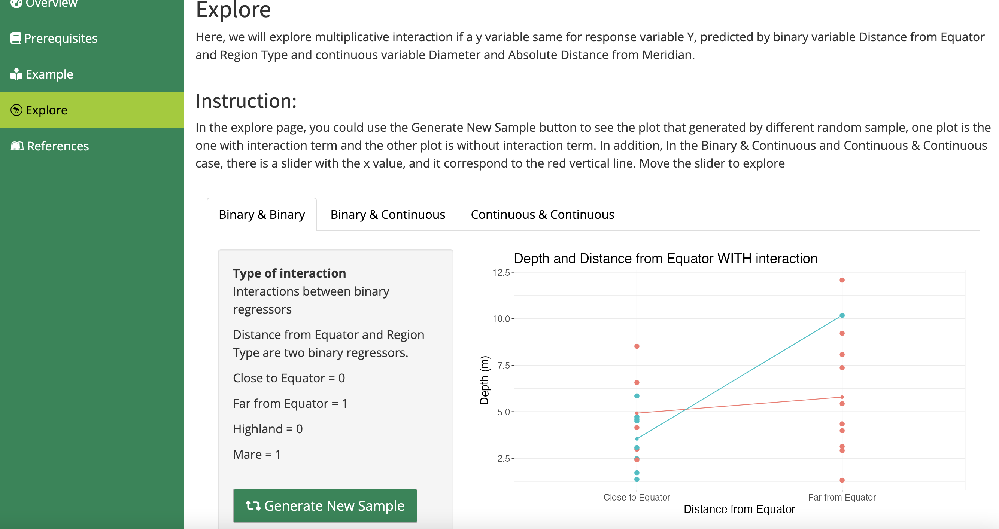

# APP_TITLE

 

# App Description
This app is focused on the Multiplicative Interaction. The student will learn to determine if there is an interaction in the plot and it can help students understand the difference between with interaction and without interaction.

